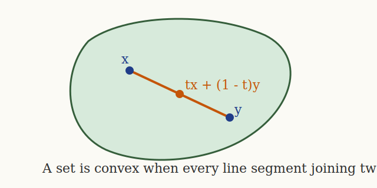
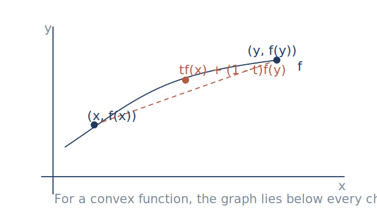

## Purpose

These notes introduce the geometric and analytic ideas that make optimization tractable in machine learning.
The central theme is that convexity converts local information, such as gradients and Hessians, into global guarantees.

## Learning objectives

After working through this note, you should be able to:

- define convex sets, convex functions, strict convexity, and strong convexity;
- explain why convexity is valuable for optimization and statistical learning;
- derive first-order and second-order necessary and sufficient conditions for unconstrained minima;
- derive the Lagrange multiplier equations for equality-constrained problems;
- state the KKT conditions and interpret them geometrically;
- explain weak and strong duality at an intuitive level; and
- recognize why non-convex objectives require different tools and expectations.

## 1. Optimization problems in ML

A large fraction of machine learning can be written as an optimization problem:

$$
\min_{\mathbf{w} \in \mathcal{C}} f(\mathbf{w}),
$$

where:

- $\mathbf{w}$ is a parameter vector or matrix;
- $f$ is an objective, often empirical risk plus regularization; and
- $\mathcal{C}$ is a constraint set, possibly all of $\mathbb{R}^d$.

Canonical examples include:

- least squares: $\min_{\mathbf{w}} \frac{1}{2}\|X\mathbf{w} - \mathbf{y}\|_2^2$;
- ridge regression: $\min_{\mathbf{w}} \frac{1}{2}\|X\mathbf{w} - \mathbf{y}\|_2^2 + \frac{\lambda}{2}\|\mathbf{w}\|_2^2$;
- logistic regression with regularization; and
- support vector machines, which combine a convex objective with convex constraints.

The mathematics of convexity matters because it allows us to certify that a point is globally optimal using only local derivative information.

## 2. Convex sets

### Definition

A set $\mathcal{C} \subseteq \mathbb{R}^d$ is **convex** if for every $\mathbf{x}, \mathbf{y} \in \mathcal{C}$ and every $t \in [0,1]$,

$$
t\mathbf{x} + (1-t)\mathbf{y} \in \mathcal{C}.
$$

The point $t\mathbf{x} + (1-t)\mathbf{y}$ is a convex combination of $\mathbf{x}$ and $\mathbf{y}$.

### Geometric picture

If the line segment between any two feasible points stays feasible, then optimization has fewer geometric pathologies.
Euclidean balls, affine subspaces, halfspaces, boxes, and simplices are convex.
Annuli and sets with holes are not convex.

### Operations that preserve convexity

If $\mathcal{C}_1, \dots, \mathcal{C}_m$ are convex, then the following are also convex:

- intersections $\bigcap_{i=1}^m \mathcal{C}_i$;
- affine images and inverse images under affine maps; and
- sublevel sets of convex functions, discussed below.

This matters in ML because many feasible regions are built by intersecting linear inequalities, norm bounds, or probability-simplex constraints.

## 3. Convex functions

### Definition

Let $\mathcal{C}$ be convex.
A function $f : \mathcal{C} \to \mathbb{R}$ is **convex** if for every $\mathbf{x}, \mathbf{y} \in \mathcal{C}$ and every $t \in [0,1]$,

$$
f(t\mathbf{x} + (1-t)\mathbf{y}) \leq tf(\mathbf{x}) + (1-t)f(\mathbf{y}).
$$

It is **strictly convex** if the inequality is strict whenever $\mathbf{x} \neq \mathbf{y}$ and $t \in (0,1)$.
It is **$\mu$-strongly convex** if, for some $\mu > 0$,

$$
f(\mathbf{y}) \geq f(\mathbf{x}) + \nabla f(\mathbf{x})^\top (\mathbf{y} - \mathbf{x}) + \frac{\mu}{2}\|\mathbf{y} - \mathbf{x}\|_2^2
$$

for all $\mathbf{x}, \mathbf{y}$ in the domain.

### Geometric picture

For a convex function, the graph never rises above the chord joining two points on the graph.
Equivalently, the epigraph

$$
\operatorname{epi}(f) = \{(\mathbf{x}, t) : t \geq f(\mathbf{x})\}
$$

is a convex set.

### Examples

1. Affine functions are both convex and concave.
2. Quadratic functions
   $$
   f(\mathbf{x}) = \frac{1}{2}\mathbf{x}^\top Q\mathbf{x} + \mathbf{b}^\top \mathbf{x} + c
   $$
   are convex when $Q \succeq 0$ and strongly convex when $Q \succ 0$.
3. The least-squares loss is convex because its Hessian is $X^\top X \succeq 0$.
4. Logistic loss is convex in the linear score.
5. The function $f(x) = x^4 - 3x^2$ is not convex on all of $\mathbb{R}$ because $f''(x) = 12x^2 - 6$ is negative near the origin.

### First-order characterization of convexity

Assume $f$ is differentiable on an open convex set.
Then $f$ is convex if and only if

$$
f(\mathbf{y}) \geq f(\mathbf{x}) + \nabla f(\mathbf{x})^\top (\mathbf{y} - \mathbf{x})
$$

for all $\mathbf{x}, \mathbf{y}$.

The right-hand side is the affine function given by the tangent hyperplane at $\mathbf{x}$.
So a differentiable convex function always lies above its first-order Taylor approximation.

### Second-order characterization of convexity

If $f$ is twice continuously differentiable on an open convex set, then:

- $f$ is convex if and only if $\nabla^2 f(\mathbf{x}) \succeq 0$ for all $\mathbf{x}$;
- $f$ is strictly convex if $\nabla^2 f(\mathbf{x}) \succ 0$ for all $\mathbf{x}$; and
- $f$ is strongly convex with parameter $\mu$ if $\nabla^2 f(\mathbf{x}) \succeq \mu I$ for all $\mathbf{x}$.

This connects optimization directly to the linear algebra of positive semidefinite matrices from Card 2.1.

## 4. Unconstrained optimization and stationary points

Consider

$$
\min_{\mathbf{x} \in \mathbb{R}^d} f(\mathbf{x}).
$$

A point $\mathbf{x}^\star$ is a **stationary point** if

$$
\nabla f(\mathbf{x}^\star) = \mathbf{0}.
$$

Every differentiable interior local minimizer is stationary.
This is the first-order necessary condition.

### Derivation of the first-order necessary condition

Suppose $\mathbf{x}^\star$ is a local minimizer.
For every direction $\mathbf{v}$, define $\phi(t) = f(\mathbf{x}^\star + t\mathbf{v})$.
Since $t=0$ is a local minimum of the one-variable function $\phi$,

$$
\phi'(0) = \nabla f(\mathbf{x}^\star)^\top \mathbf{v} = 0
$$

for every $\mathbf{v}$.
The only vector orthogonal to every direction is the zero vector, so $\nabla f(\mathbf{x}^\star) = \mathbf{0}$.

### Second-order test

If $f$ is twice differentiable and $\mathbf{x}^\star$ is a local minimizer, then

$$
\nabla^2 f(\mathbf{x}^\star) \succeq 0.
$$

This is necessary but not sufficient by itself.
The point $x=0$ for $f(x)=x^4$ has $f''(0)=0$ yet is still a minimum.

If $\nabla f(\mathbf{x}^\star)=0$ and $\nabla^2 f(\mathbf{x}^\star)\succ 0$, then $\mathbf{x}^\star$ is a strict local minimizer.
If $\nabla^2 f(\mathbf{x}^\star)$ has a negative eigenvalue, then $\mathbf{x}^\star$ cannot be a local minimizer; it is a saddle or worse.

### Why convexity changes the picture

For a general non-convex function, stationary points may be:

- local minima;
- local maxima; or
- saddle points.

For a differentiable convex function, every stationary point is a global minimizer.

This follows immediately from the first-order convexity inequality:

$$
f(\mathbf{y}) \geq f(\mathbf{x}^\star) + \nabla f(\mathbf{x}^\star)^\top(\mathbf{y}-\mathbf{x}^\star) = f(\mathbf{x}^\star).
$$

So the equation $\nabla f(\mathbf{x}^\star)=0$ becomes globally informative in the convex setting.

## 5. Quadratic objectives as the prototype

Quadratic objectives are the local model behind Newton's method and the global model behind least squares.
Let

$$
f(\mathbf{x}) = \frac{1}{2}\mathbf{x}^\top Q \mathbf{x} - \mathbf{b}^\top \mathbf{x} + c,
$$

with $Q = Q^\top$.
Then

$$
\nabla f(\mathbf{x}) = Q\mathbf{x} - \mathbf{b},
\qquad
\nabla^2 f(\mathbf{x}) = Q.
$$

Therefore:

- if $Q \succ 0$, the minimizer is unique and satisfies $Q\mathbf{x}^\star = \mathbf{b}$;
- if $Q \succeq 0$, minimizers may fail to be unique; and
- if $Q$ is indefinite, the function is non-convex.

In least squares,

$$
f(\mathbf{w}) = \frac{1}{2}\|X\mathbf{w} - \mathbf{y}\|_2^2
= \frac{1}{2}\mathbf{w}^\top X^\top X \mathbf{w} - \mathbf{y}^\top X \mathbf{w} + \frac{1}{2}\|\mathbf{y}\|_2^2,
$$

so convexity comes from $X^\top X \succeq 0$.

## 6. Equality constraints and Lagrange multipliers

Now consider

$$
\min_{\mathbf{x} \in \mathbb{R}^d} f(\mathbf{x})
\quad \text{subject to} \quad
g_i(\mathbf{x}) = 0, \quad i=1,\dots,m.
$$

Define the Lagrangian

$$
\mathcal{L}(\mathbf{x}, \boldsymbol{\lambda})
= f(\mathbf{x}) + \sum_{i=1}^m \lambda_i g_i(\mathbf{x}).
$$

### Geometric intuition

At a constrained optimum, you cannot move along feasible directions and decrease the objective.
If the constraints are smooth, feasible directions lie in the tangent space determined by the gradients $\nabla g_i(\mathbf{x}^\star)$.
The gradient of the objective must therefore be a linear combination of the constraint gradients:

$$
\nabla f(\mathbf{x}^\star) + \sum_{i=1}^m \lambda_i \nabla g_i(\mathbf{x}^\star) = 0.
$$

Together with feasibility, this gives the Lagrange multiplier equations:

$$
\nabla_{\mathbf{x}} \mathcal{L}(\mathbf{x}^\star, \boldsymbol{\lambda}^\star) = 0,
\qquad
g_i(\mathbf{x}^\star)=0 \text{ for all } i.
$$

### Example: PCA and norm constraints

To find the principal component direction, maximize

$$
\mathbf{v}^\top S \mathbf{v}
\quad \text{subject to} \quad
\|\mathbf{v}\|_2^2 = 1.
$$

The Lagrangian is

$$
\mathcal{L}(\mathbf{v}, \lambda) = \mathbf{v}^\top S\mathbf{v} - \lambda(\mathbf{v}^\top \mathbf{v} - 1).
$$

Stationarity yields

$$
2S\mathbf{v} - 2\lambda \mathbf{v} = 0,
$$

so $S\mathbf{v} = \lambda \mathbf{v}$.
The constrained optimizer is therefore an eigenvector problem.

## 7. Inequality constraints and KKT conditions

For

$$
\min_{\mathbf{x}} f(\mathbf{x})
\quad \text{subject to} \quad
g_i(\mathbf{x}) \leq 0, \ i=1,\dots,m,
\quad
h_j(\mathbf{x}) = 0, \ j=1,\dots,p,
$$

the Lagrangian becomes

$$
\mathcal{L}(\mathbf{x}, \boldsymbol{\lambda}, \boldsymbol{\nu})
= f(\mathbf{x})
+ \sum_{i=1}^m \lambda_i g_i(\mathbf{x})
+ \sum_{j=1}^p \nu_j h_j(\mathbf{x}),
$$

with $\lambda_i \geq 0$.

Under suitable regularity conditions, a local optimum must satisfy the **Karush-Kuhn-Tucker conditions**:

1. stationarity:
   $$
   \nabla f(\mathbf{x}^\star)
   + \sum_{i=1}^m \lambda_i^\star \nabla g_i(\mathbf{x}^\star)
   + \sum_{j=1}^p \nu_j^\star \nabla h_j(\mathbf{x}^\star)
   = 0;
   $$
2. primal feasibility:
   $$
   g_i(\mathbf{x}^\star) \leq 0, \qquad h_j(\mathbf{x}^\star)=0;
   $$
3. dual feasibility:
   $$
   \lambda_i^\star \geq 0;
   $$
4. complementary slackness:
   $$
   \lambda_i^\star g_i(\mathbf{x}^\star)=0 \quad \text{for each } i.
   $$

Complementary slackness says each inequality is either inactive, so $g_i(\mathbf{x}^\star)<0$ and $\lambda_i^\star=0$, or active, so it contributes a force term through its multiplier.

The full derivation appears in [KKT conditions](../derivations/kkt-conditions.md).

## 8. Duality intuition

Duality deserves a later, deeper treatment.
Here we only establish the core picture.

### From constraints to a lower bound

Fix multipliers with $\lambda_i \geq 0$ and define the dual function

$$
q(\boldsymbol{\lambda}, \boldsymbol{\nu})
= \inf_{\mathbf{x}} \mathcal{L}(\mathbf{x}, \boldsymbol{\lambda}, \boldsymbol{\nu}).
$$

If $\mathbf{x}$ is primal feasible, then $g_i(\mathbf{x}) \leq 0$ and $h_j(\mathbf{x})=0$, so

$$
\mathcal{L}(\mathbf{x}, \boldsymbol{\lambda}, \boldsymbol{\nu}) \leq f(\mathbf{x}).
$$

Taking the infimum over $\mathbf{x}$ gives

$$
q(\boldsymbol{\lambda}, \boldsymbol{\nu}) \leq f(\mathbf{x})
$$

for every primal feasible $\mathbf{x}$.
Therefore every dual feasible choice yields a lower bound on the primal optimum in a minimization problem.
This is **weak duality**.

### Why duality matters in ML

Duality is useful because:

- lower bounds certify how far we are from optimality;
- the dual problem may be easier than the primal;
- constraints in the primal can become variables in the dual; and
- kernel methods, especially SVMs, are often expressed most naturally in dual form.

### SVM preview

Hard-margin SVM solves

$$
\min_{\mathbf{w}, b} \frac{1}{2}\|\mathbf{w}\|_2^2
\quad \text{subject to} \quad
y_i(\mathbf{w}^\top \mathbf{x}_i + b) \geq 1.
$$

This is a convex optimization problem:

- the objective is strongly convex in $\mathbf{w}$;
- each constraint defines a halfspace; and
- the feasible region is an intersection of halfspaces.

The Lagrange multipliers attached to the margin constraints identify support vectors, which is one of the reasons duality becomes operational rather than merely abstract.

## 9. First-order versus second-order reasoning

There are two complementary ways to think about optimization:

- **first-order reasoning** uses gradients and tangent hyperplanes;
- **second-order reasoning** uses Hessians and local curvature.

First-order methods, such as gradient descent and stochastic gradient descent, scale well and dominate large ML systems.
Second-order methods provide sharper local models and motivate Newton and quasi-Newton methods.

Convexity ties these together:

- first-order conditions become global certificates;
- positive semidefinite Hessians encode convexity; and
- positive definite Hessians imply local quadratic growth and uniqueness.

## 10. A non-convex example and why it matters

Consider

$$
f(x) = x^4 - 3x^2.
$$

Then

$$
f'(x) = 4x^3 - 6x = 2x(2x^2 - 3),
\qquad
f''(x) = 12x^2 - 6.
$$

The stationary points are:

- $x=0$, where $f''(0)=-6 < 0$, so this is a local maximum;
- $x=\pm \sqrt{3/2}$, where $f''(x)>0$, so these are local minima.

This objective has multiple basins and no single global certificate from stationarity alone.
That is the basic loss-landscape phenomenon that later reappears in neural network training, where saddle points, flat regions, and many local minima or near-minima shape algorithmic behavior.

## 11. ML relevance summary

The optimization ideas in this note reappear throughout the course:

- linear regression uses convex quadratics;
- logistic regression uses a convex empirical risk;
- SVMs use constrained convex optimization and duality;
- PCA uses Lagrange multipliers;
- neural networks break convexity and force us into iterative local methods; and
- regularization often improves both statistical behavior and optimization geometry.

## 12. Category-theoretic insertion point

At a light structural level, optimization can be viewed as a rule that maps:

- a parameter space;
- an objective function; and
- a feasible set

to a set of minimizers or to an iterative update process.
In later modules, that perspective helps compare learning pipelines as compositions of transformations rather than isolated formulas.

## 13. Unity Theory insertion point

In this module, a disciplined Unity Theory companion reading would treat optimization as directed transformation under constraints.
That perspective is interpretive rather than canonical.
The canonical mathematical content remains the gradient, Hessian, constraint geometry, and duality statements developed above.

## References

- Stephen Boyd and Lieven Vandenberghe, *Convex Optimization*, Chapters 2 to 5.
- Dimitri Bertsekas, *Nonlinear Programming*, for broader constrained optimization context.
