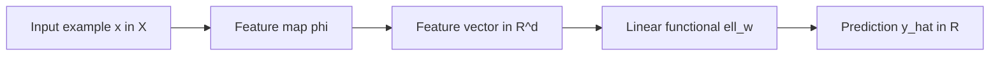
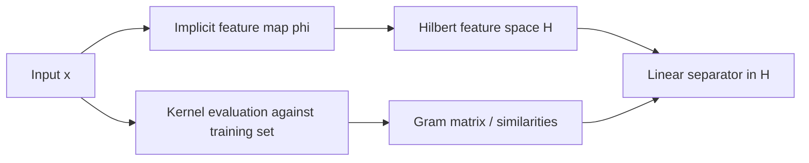
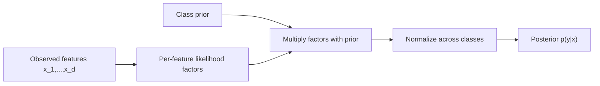
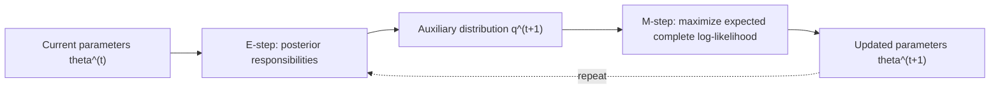
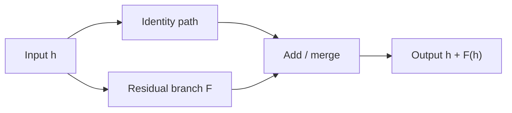
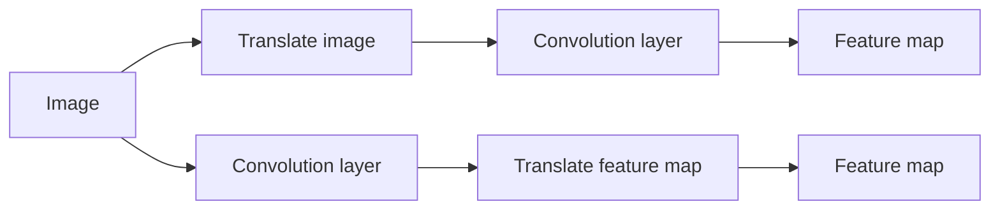
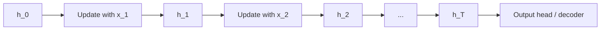
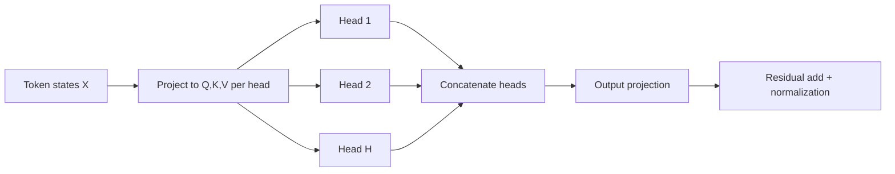

# A Categorical View of ML Pipelines

## Purpose

This note is a **structural clarification** companion for Modules 03-10.
It asks a narrow question:

> When does categorical language make an ML pipeline easier to reason about, and when is it only a change of notation?

The standard mathematics in the source modules remains primary.
This note does not replace derivations, optimization theory, or probabilistic semantics.

## Working conventions

Across the examples, we use the lightest categorical setup that still says something precise.

- An **object** is a typed space such as an input space, feature space, latent-state space, parameter space, or probability simplex.
- A **morphism** is a map that the source module already treats as meaningful: feature extraction, a linear layer, a normalization map, an optimizer step, a transition kernel, or an aggregation rule.
- A **commutative square** means two implementation routes should agree.
- A **product-like object** models parallel branches.
- An **endomorphism** models an update rule repeatedly applied to the same kind of state.

The discipline is simple:

- if the source module already has a typed composition of maps, the categorical reading is usually literal;
- if the source module depends on estimation, approximation, or optimization guarantees, the categorical reading is only partial.

## Example 1: Linear regression as feature map then linear functional

Source anchors:
- [modules/03-linear-models/notes/linear-regression.md](../../03-linear-models/notes/linear-regression.md)
- [modules/03-linear-models/notebooks/LM-01-linear-regression.ipynb](../../03-linear-models/notebooks/LM-01-linear-regression.ipynb)

The source note already isolates the useful factorization
$$
\mathcal{X} \xrightarrow{\phi} \mathbb{R}^d \xrightarrow{\ell_w} \mathbb{R}.
$$

Here $\phi$ is the chosen feature representation and $\ell_w$ is the learned linear functional.
This becomes concrete in the notebook when polynomial features are used before least-squares fitting.

**What the categorical view adds**

- It separates representation choice from estimator choice.
- It makes clear why changing polynomial degree changes the object on which linear regression acts.
- It gives a reusable diagram that later reappears in kernels, CNN backbones, and transfer learning.

**What it does not add**

- It does not explain why least squares equals Gaussian MLE.
- It does not solve conditioning, multicollinearity, or regularization.

**Verdict:** genuinely useful as a first compositional template.

## Example 2: Logistic regression as score map then probability map

Source anchors:
- [modules/03-linear-models/notes/logistic-regression.md](../../03-linear-models/notes/logistic-regression.md)
- [modules/03-linear-models/notebooks/LM-02-logistic-regression.ipynb](../../03-linear-models/notebooks/LM-02-logistic-regression.ipynb)

For binary classification the note gives
$$
\mathbb{R}^d \xrightarrow{s_\theta} \mathbb{R} \xrightarrow{\sigma} (0,1),
$$
and for multiclass classification,
$$
\mathbb{R}^d \xrightarrow{s_\Theta} \mathbb{R}^K \xrightarrow{\mathrm{softmax}} \Delta^{K-1}.
$$

This example matters because the pipeline is not just prediction; it is a typed path from features to a probability object.

**What the categorical view adds**

- It highlights that the classifier head lands in a probability simplex, not just in an arbitrary vector space.
- It cleanly distinguishes score space from probability space.
- It gives a reusable interface for later softmax heads in sequence models and transformers.

**What it does not add**

- It does not derive the exponential-family form.
- It does not explain calibration or optimization behavior by itself.

**Verdict:** useful, but mostly as careful bookkeeping.

## Example 3: Kernel methods as explicit factorization versus implicit factorization

Source anchors:
- [modules/04-kernel-methods/notes/kernel-methods.md](../../04-kernel-methods/notes/kernel-methods.md)
- [modules/04-kernel-methods/derivations/kernel-trick.md](../../04-kernel-methods/derivations/kernel-trick.md)
- [modules/04-kernel-methods/notebooks/KM-01-kernels-and-svms.ipynb](../../04-kernel-methods/notebooks/KM-01-kernels-and-svms.ipynb)

The core structural split is
$$
\mathcal{X} \xrightarrow{\phi} \mathcal{H} \xrightarrow{\ell_w} \mathbb{R},
$$
but the kernel trick replaces direct access to $\phi(x)$ by the Gram map
$$
(\mathcal{X} \times \mathcal{X}) \xrightarrow{K} \mathbb{R}.
$$

The categorical gain is not the slogan "kernels are morphisms." The gain is the comparison of two factorizations of the same predictor: one explicit, one interface-based.

**What the categorical view adds**

- It makes the kernel a change in interface rather than a mystical nonlinear trick.
- It clarifies that the learned map depends only on pairwise inner-product information.
- It helps explain why some algorithms kernelize cleanly and others do not: the interface must factor through admissible pairwise evaluations.

**What it does not add**

- It does not prove PSD characterizations.
- It does not replace margin geometry or RKHS analysis.

**Verdict:** genuinely useful for practitioners deciding whether a method can be kernelized.

## Example 4: Naive Bayes as product factorization with a normalization map

Source anchors:
- [modules/05-probabilistic-modeling/notes/graphical-models.md](../../05-probabilistic-modeling/notes/graphical-models.md)
- [modules/05-probabilistic-modeling/notebooks/PM-01-naive-bayes.ipynb](../../05-probabilistic-modeling/notebooks/PM-01-naive-bayes.ipynb)

Naive Bayes factorizes as
$$
p(y, x_1,\dots,x_d) = p(y)\prod_{j=1}^d p(x_j \mid y).
$$
Operationally, prediction is a composite:

1. map a document or feature vector to class-conditional likelihood contributions;
2. combine those contributions across features;
3. normalize into a posterior over classes.

**What the categorical view adds**

- It emphasizes modular factorization: local pieces first, global normalization second.
- It aligns Naive Bayes with later message-passing and attention examples, where local scores are also aggregated before normalization.

**What it does not add**

- The independence assumptions are probabilistic, not categorical.
- The categorical reading is weaker here than the graphical-model reading.

**Verdict:** mostly alternative notation, with some payoff as a precursor to later aggregation pipelines.

## Example 5: EM for Gaussian mixtures as alternating endomorphisms

Source anchors:
- [modules/05-probabilistic-modeling/notes/em-algorithm.md](../../05-probabilistic-modeling/notes/em-algorithm.md)
- [modules/05-probabilistic-modeling/derivations/em-derivation.md](../../05-probabilistic-modeling/derivations/em-derivation.md)
- [modules/05-probabilistic-modeling/notebooks/PM-02-em-gmm.ipynb](../../05-probabilistic-modeling/notebooks/PM-02-em-gmm.ipynb)

EM alternates between an E-step and an M-step. Structurally, it is best seen as repeated application of an update on the state space
$$
(\theta, q) \mapsto (M(q), E(\theta)).
$$
If we compress the bookkeeping, one full EM sweep is an endomorphism
$$
T_{\mathrm{EM}} : \Theta \to \Theta.
$$

**What the categorical view adds**

- It isolates EM as an iterative operator rather than a one-shot estimator.
- It cleanly compares EM with gradient descent and recurrent update maps elsewhere in the curriculum.
- It makes the monotonicity statement easy to phrase: the same type of state is updated by repeated composite sweeps.

**What it does not add**

- It does not prove the ELBO identity.
- It does not explain local optima, initialization sensitivity, or convergence rate.

**Verdict:** useful for cross-module comparison of training procedures, but secondary to the variational derivation.

## Example 6: Feedforward networks and training loops as nested compositions

Source anchors:
- [modules/06-neural-networks/notes/neural-networks-first-principles.md](../../06-neural-networks/notes/neural-networks-first-principles.md)
- [modules/06-neural-networks/derivations/backpropagation.md](../../06-neural-networks/derivations/backpropagation.md)
- [modules/06-neural-networks/notebooks/NN-02-backprop-from-scratch.ipynb](../../06-neural-networks/notebooks/NN-02-backprop-from-scratch.ipynb)
- [modules/06-neural-networks/notebooks/NN-03-training-loop.ipynb](../../06-neural-networks/notebooks/NN-03-training-loop.ipynb)

A depth-$L$ network is literally a composite
$$
X \xrightarrow{f_1} H_1 \xrightarrow{f_2} \cdots \xrightarrow{f_L} Y.
$$
Training adds a second pipeline:
$$
(\theta, B) \mapsto \nabla_\theta \mathcal{L}_B(\theta) \mapsto \theta',
$$
where $B$ is a mini-batch.

This is one of the cleanest places for categorical language because forward computation and parameter update are both typed compositions.

**What the categorical view adds**

- It separates model composition from training composition.
- It makes backpropagation look like reverse traversal of a composed graph, which is exactly how practitioners debug implementations.
- It gives a reusable diagram for later CNN, RNN, and transformer training loops.

**What it does not add**

- It does not compute gradients.
- It does not explain loss landscapes or generalization.

**Verdict:** genuinely useful and directly reusable in labs.

## Example 7: Residual blocks as branch, identity, and merge

Source anchors:
- [modules/07-deep-learning-systems/notes/training-deep-networks.md](../../07-deep-learning-systems/notes/training-deep-networks.md)
- [modules/08-cnn-vision/notes/cnn-architectures.md](../../08-cnn-vision/notes/cnn-architectures.md)
- [modules/07-deep-learning-systems/notebooks/DL-03-residual-connections.ipynb](../../07-deep-learning-systems/notebooks/DL-03-residual-connections.ipynb)

ResNet blocks implement
$$
x \mapsto x + F(x).
$$
Categorically, the important move is not plain composition but product-style branching followed by an addition map
$$
H \xrightarrow{\langle \mathrm{id}, F \rangle} H \times H \xrightarrow{+} H.
$$

This is one of the strongest examples in the module because it explains an architecture pattern that ordinary chain notation hides.

**What the categorical view adds**

- It isolates the skip path as a first-class morphism rather than a coding trick.
- It makes clear why residual networks need parallel and sequential composition at once.
- It transfers directly to U-Nets, highway nets, and transformer residual shells.

**What it does not add**

- It does not quantify gradient improvement.
- It does not tell us when projection shortcuts are required for shape changes.

**Verdict:** highly useful.

## Example 8: CNNs as approximately equivariant squares

Source anchors:
- [modules/08-cnn-vision/notes/convolutional-networks.md](../../08-cnn-vision/notes/convolutional-networks.md)
- [modules/08-cnn-vision/notebooks/CNN-01-convolution-from-scratch.ipynb](../../08-cnn-vision/notebooks/CNN-01-convolution-from-scratch.ipynb)
- [modules/08-cnn-vision/notebooks/CNN-03-transfer-learning.ipynb](../../08-cnn-vision/notebooks/CNN-03-transfer-learning.ipynb)

The note states the key structural claim: convolution is useful because it approximately commutes with translations.
If $\tau$ is a translation on the image grid and $\widetilde{\tau}$ is the induced translation on feature maps, then the intended square is
$$
\mathrm{Conv} \circ \tau \approx \widetilde{\tau} \circ \mathrm{Conv}.
$$

The same note later splits vision transfer learning into backbone plus head:
$$
\text{image} \to \text{pretrained backbone} \to \text{feature tensor} \to \text{new task head}.
$$
That is the same compositional template as linear regression, now with a much richer $\phi$.

**What the categorical view adds**

- It gives a precise statement of equivariance rather than a slogan.
- It explains why pretrained backbones transfer: the head can change while the representation morphism is reused.
- It lets us distinguish exact equivariance from the approximate behavior induced by padding and pooling.

**What it does not add**

- It does not replace Fourier analysis, receptive-field calculations, or augmentation experiments.
- The approximation symbol matters; this is not an exact commuting square in deployed CNNs.

**Verdict:** highly useful.

## Example 9: RNNs as repeated endomorphisms with shared parameters

Source anchors:
- [modules/09-sequence-models/notes/sequence-modeling.md](../../09-sequence-models/notes/sequence-modeling.md)
- [modules/09-sequence-models/notebooks/SEQ-01-rnn-from-scratch.ipynb](../../09-sequence-models/notebooks/SEQ-01-rnn-from-scratch.ipynb)
- [modules/09-sequence-models/notebooks/SEQ-02-lstm-language-model.ipynb](../../09-sequence-models/notebooks/SEQ-02-lstm-language-model.ipynb)

For a fixed input token $x_t$, the recurrent update
$$
h_t = \phi(W_{xh}x_t + W_{hh}h_{t-1} + b_h)
$$
defines an endomorphism on hidden-state space once $x_t$ is supplied.
Across a sequence, the unrolled graph is repeated composition of same-typed maps with shared parameters.

**What the categorical view adds**

- It makes parameter tying explicit as reuse of the same morphism shape over time.
- It shows why backpropagation through time is ordinary backpropagation on a repeated composite.
- It puts RNNs, EM, and optimizer steps under one common repeated-update pattern.

**What it does not add**

- It does not explain vanishing or exploding gradients without Jacobian analysis.
- It does not solve the memory bottleneck that motivates attention.

**Verdict:** useful, especially pedagogically.

## Example 10: Transformers as parallel heads plus residual shells

Source anchors:
- [modules/10-transformers-llms/notes/transformer-foundations.md](../../10-transformers-llms/notes/transformer-foundations.md)
- [modules/10-transformers-llms/derivations/self-attention.md](../../10-transformers-llms/derivations/self-attention.md)
- [modules/10-transformers-llms/notebooks/TF-01-attention-from-scratch.ipynb](../../10-transformers-llms/notebooks/TF-01-attention-from-scratch.ipynb)
- [modules/10-transformers-llms/notebooks/TF-02-transformer-training.ipynb](../../10-transformers-llms/notebooks/TF-02-transformer-training.ipynb)

Transformer structure combines several earlier categorical patterns at once:

- a single attention head is a typed composite;
- multi-head attention is parallel composition followed by concatenation and projection;
- the whole block is wrapped by residual morphisms;
- positional encoding deliberately breaks a symmetry that plain self-attention preserves.

The permutation-equivariance statement from the source note is one of the cleanest exact categorical observations in the whole course:
plain attention commutes with simultaneous permutation of token positions.
Positional encodings are added precisely because that commuting property is too strong for language.

**What the categorical view adds**

- It makes multi-head attention legible as parallel composition instead of opaque tensor code.
- It connects transformer blocks to residual CNNs and other branch-and-merge systems.
- It states the role of positional encodings precisely: they break an unwanted symmetry.

**What it does not add**

- It does not replace the matrix algebra of attention.
- It does not explain scaling laws, optimization stability, or inference-time systems issues.

**Verdict:** highly useful.

## Comparison table: where categorical language helps and where it does not

| Course example | Main categorical pattern | What becomes clearer | What stays in the source module's native mathematics | Overall judgment |
| --- | --- | --- | --- | --- |
| Linear regression | sequential composition | representation versus predictor | least squares, projection, Gaussian MLE | Useful |
| Logistic regression | composition into simplex-valued output | score space versus probability space | exponential-family derivation, calibration, optimization | Moderately useful |
| Kernel methods | interface factorization through inner products | explicit versus implicit feature pipelines | PSD kernels, RKHS theory, margin analysis | Useful |
| Naive Bayes | local factor aggregation then normalization | modular factorization pipeline | probabilistic independence assumptions | Mostly alternative notation |
| EM for GMMs | repeated endomorphism / alternating updates | iteration structure and state updates | ELBO, monotonicity proof, local optima | Moderately useful |
| Feedforward NN training | nested forward and backward compositions | model graph versus training graph | gradient formulas and optimization geometry | Useful |
| Residual blocks | product-style branching and merge | why skip connections are structural | quantitative gradient transport analysis | Very useful |
| CNN equivariance | approximate commuting square | exact meaning of equivariance and transfer reuse | boundary effects, receptive fields, empirical augmentation behavior | Very useful |
| RNN unrolling | repeated composition with shared morphism | parameter tying and BPTT structure | Jacobian products, long-memory failures | Useful |
| Transformer blocks | monoidal parallelism plus residual shells | multi-head structure and symmetry breaking | attention algebra, systems scaling, sampling behavior | Very useful |

## Reusable diagram patterns

The worked examples above reduce to five diagram templates that recur across the curriculum.

1. **Feature map then head**
   $$
   X \to H \to Y.
   $$
   Used in linear models, logistic regression, CNN transfer learning, and transformer classifiers.

2. **Branch and merge**
   $$
   H \to H \times H \to H.
   $$
   Used in residual networks and multimodal fusion.

3. **Commuting symmetry square**
   $$
   X \xrightarrow{a} X,\qquad
   H \xrightarrow{\widetilde{a}} H,\qquad
   f \circ a = \widetilde{a} \circ f.
   $$
   Used in CNN equivariance and in any later group-equivariant model.

4. **Repeated endomorphism**
   $$
   S \xrightarrow{u} S \xrightarrow{u} S \xrightarrow{u} \cdots
   $$
   Used in optimizer steps, EM, and recurrent updates.

5. **Parallel heads then recombination**
   $$
   X \to H_1 \times \cdots \times H_m \to Y.
   $$
   Used in multi-head attention and other multi-branch architectures.

## Honesty check

The categorical viewpoint is most credible when it does one of three things:

- separates a pipeline into reusable typed stages;
- states a symmetry or compatibility requirement as a commutative diagram; or
- makes parallel composition visible in an architecture that ordinary chain notation obscures.

It is least credible when it tries to replace:

- statistical assumptions;
- convergence proofs;
- detailed tensor algebra; or
- empirical claims about performance.

That boundary is not a weakness.
It is what keeps the categorical layer useful rather than ornamental.
